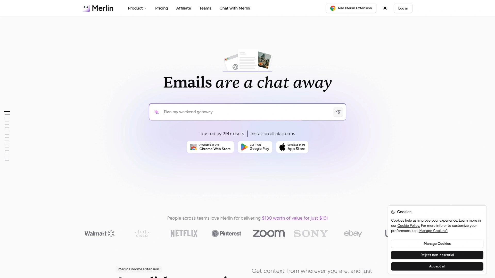
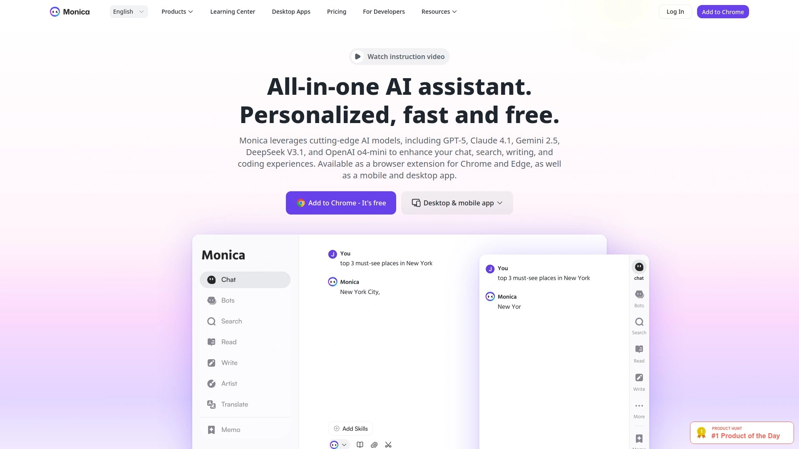
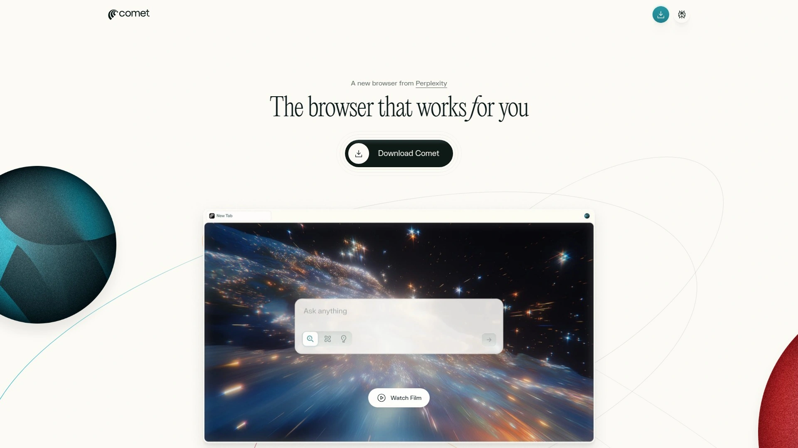
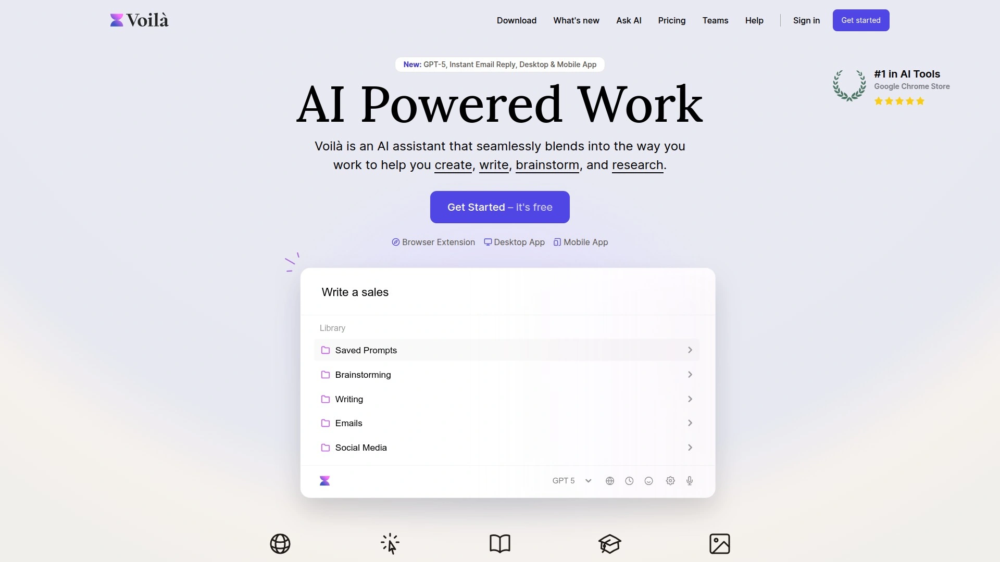
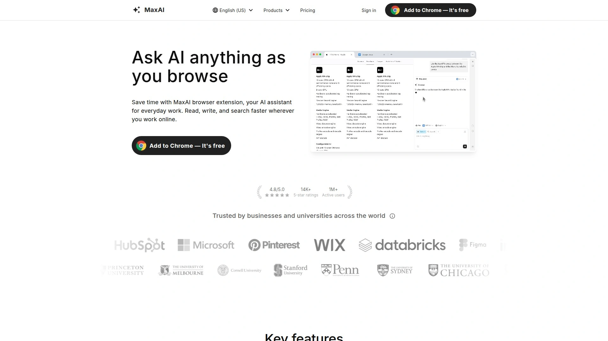
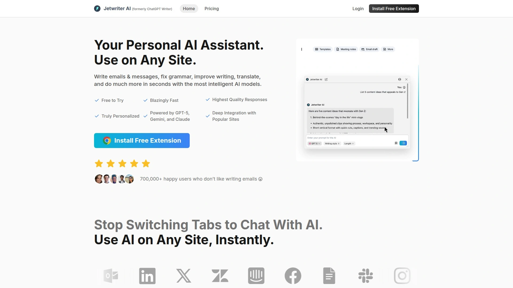
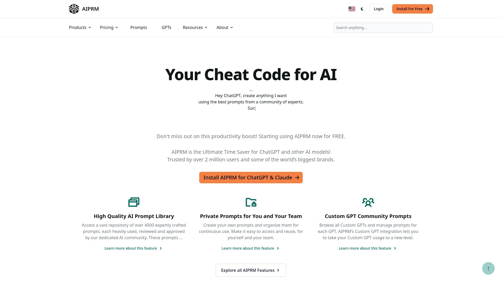
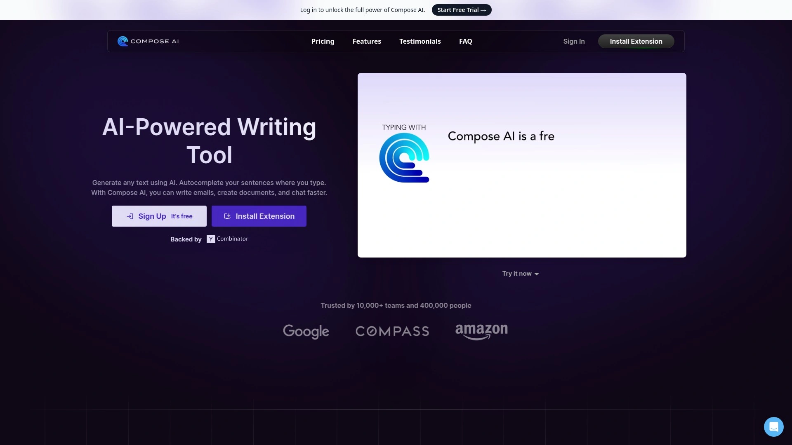
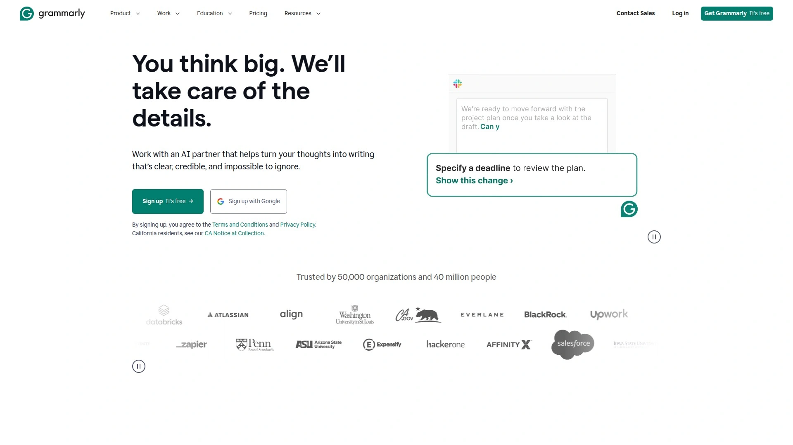
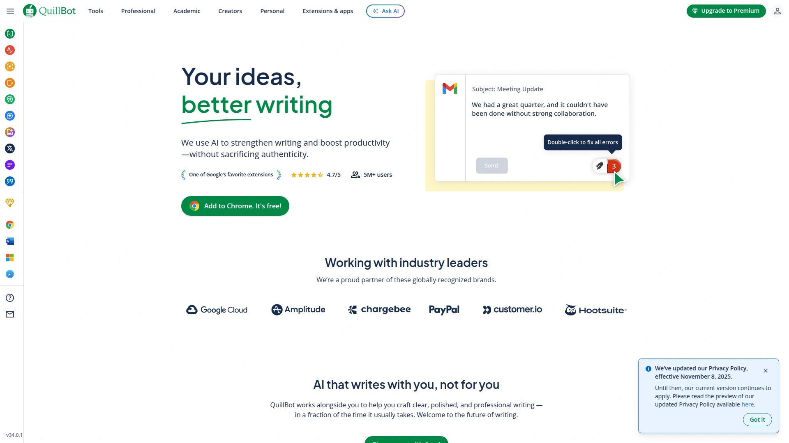

# 11 Most Recommended AI Browser Extensions in 2025

Browser tabs multiply like rabbits, information overload crushes your focus, and writing the same types of emails over and over drains hours you'll never get back. AI browser extensions fix this by embedding intelligent assistants directly into your workflow—no app switching, no copying text between tools, just instant help wherever you're already working. The best extensions combine multiple AI models, understand webpage context, and handle everything from summarizing articles to drafting professional responses in seconds. These tools transform your browser into a productivity powerhouse that saves hours weekly while maintaining quality.

***

## **[Merlin AI](https://www.getmerlin.in)**

All-in-one AI assistant combining GPT-4o, Claude 3.7 Sonnet, Gemini 2.5 Pro, and 70+ tools accessible from any webpage with one keyboard shortcut.

Merlin dominates the browser extension space by bundling access to the biggest AI models under one roof, eliminating the need for multiple subscriptions. Hit Cmd+M on Mac or Ctrl+M on Windows, and a command bar appears instantly on any webpage you're viewing. The platform provides 26-in-1 functionality including research assistance, content rewriting, and webpage summarization without leaving your current tab.

What makes Merlin different is its AI Playground feature, giving you simultaneous access to ChatGPT o1, GPT-4o, Claude 3.7 Sonnet, and more in a single interface for richer insights. The context-aware design means you can chat directly with webpages, PDFs, and YouTube videos through the sidebar. Save custom prompts using "/" for instant deployment anywhere online. Users consistently praise the speed, with one calling it "one of the most convenient tools available today".

The Crafts feature generates diagrams, charts, and code from text prompts, while Projects lets you upload documents to create personalized knowledge bases the AI references when answering. Analyst Mode activates automatically when you drop CSV files into chat, allowing Python execution for data analysis. Pricing starts at $19 monthly when billed annually, delivering tremendous value compared to paying separately for each AI model. The Chrome extension has over 2 million users and works seamlessly in Gmail for email composition and replies. Best for professionals who want comprehensive AI capabilities without juggling multiple platforms or subscriptions.

***

## **[Monica AI](https://monica.im)**

Personalized AI assistant running GPT-5, Claude 4.1, Gemini 2.5, and DeepSeek V3.1 across browser, desktop, and mobile with one-click sidebar access.

Monica positions itself as the all-in-one AI assistant that works where you work, available as a Chrome and Edge extension plus mobile and desktop apps. The AI sidebar opens with one click on any webpage, providing seamless access to chat, translation, summarization, and content generation. The smart toolbar appears when you select text, instantly offering options to explain, translate, or summarize without interrupting your flow.

The writing assistant integrates directly into text fields across the web, helping you draft or rewrite content in place. Monica supports cutting-edge models including OpenAI o4-mini, allowing you to switch between AIs based on task requirements. The platform excels at web enhancement by understanding page context and providing relevant assistance. Users appreciate the clean interface and fast response times across all platforms. Group chat functionality lets you ask one question and receive answers from multiple AI models simultaneously for comparison. The extension works particularly well for reading foreign content, replying to tweets, and generating YouTube comments using appropriate tone. Free daily queries make it accessible for testing before committing to paid plans. Ideal for users wanting consistent AI assistance across every device they own.

***

## **[Sider AI](https://sider.ai)**

Browser copilot offering GPT-5, Claude 4, Gemini 2.5, and Grok 4 in a sidebar with translation, recording, and group AI chat capabilities.

Sider transforms your browser into an AI-powered workspace by adding a persistent sidebar that helps you read and write across all websites. The extension supports o4-mini, o3, GPT-4.1, and Claude 3.5 models, giving you flexibility to match AI capabilities to specific tasks. One standout feature is effortless recording—capture audio and video from any webpage with one click while AI generates automatic summaries, highlights, and action items.

The group AI chat feature lets you pose a single question and compare responses from ChatGPT, Claude, Gemini, Llama, and other models side-by-side. Sider's translation features include webpage translation using multiple AI models, perfect for reading foreign news, blogs, or documentation without leaving your browser. The PDF translator handles documents directly within the extension. Real-time organization means your recordings and notes are automatically structured for easy retrieval. Installation is straightforward across Chrome, Edge, and Safari. Users on Reddit describe Sider as having a "slick design" with customizable hotkeys and non-obtrusive interface elements. The tool works particularly well for students, researchers, and multilingual professionals who need comprehensive AI assistance without context switching. REC Note feature combines your manual notes with AI transcripts into clear, structured documents. Strong choice for anyone juggling multiple languages and content formats daily.

***

## **[Perplexity Comet](https://www.perplexity.ai/comet/)**

AI-driven browser functioning as a personal assistant capable of web searching, tab management, composing emails, and online shopping with free global access.

Perplexity launched Comet globally in October 2025 at no cost after initially offering it exclusively to Max subscribers for $200 monthly. The browser integrates AI at its core rather than retrofitting features onto traditional navigation tools. Comet handles multiple assistant tasks including searching, managing tabs, writing emails, and facilitating purchases without manual intervention.

The waitlist reportedly reached millions before the free launch, signaling strong market demand. Perplexity designed Comet to compete directly against Google's Gemini in Chrome, Anthropic's browser-based agent, and OpenAI's Operator. Students can access Comet with free Perplexity Pro, making it particularly attractive for academic research. The browser provides straightforward answers to queries while linking to original sources, addressing concerns about content attribution.

Background Assistant functionality is in development, promising to handle multiple tasks simultaneously and asynchronously. A mobile version is also planned for future release. Comet represents Perplexity's vision for "browsing at the speed of thought," eliminating friction between intention and action. The companion Chrome extension lets you ask questions directly from your toolbar and get instant page summaries without opening new tabs. Best for users seeking a ground-up AI browser experience rather than extensions bolted onto existing browsers.

***

## **[Voila AI](https://www.getvoila.ai)**

AI assistant with expert prompt library that reads webpages, drafts emails, improves writing, and chats with documents across all platforms.

Voila seamlessly blends into your workflow to help create, write, brainstorm, and research wherever you work online. Unlike tools requiring app switching, Voila works on any website and understands your work context automatically. The extension reads websites, articles, URLs, and email conversations to help you summarize, rewrite, translate, reply, or generate new content.

The expert prompt library provides pre-built templates for writing, brainstorming, and research, eliminating the need to craft prompts from scratch. You can save and organize your most powerful custom prompts for easy reuse. Email functionality includes draft assistance, improvement suggestions, templates, and one-click AI-powered Instant Reply. Built-in language tools fix spelling and grammar, rewrite text, translate content, paraphrase, and summarize documents.

Chat with documents and images by uploading files for instant analysis, rewriting, translation, or summarization. The image generator creates visual content from text descriptions. YouTube transcript features let you summarize, transcribe, or create content from videos. Voila is available on Windows, Mac, iOS, and Android, ensuring consistent experience across devices. Team collaboration features include shared workflows and templates for organizational productivity. Trusted by over 100,000 industry leaders worldwide. One reviewer called it "the AI Assistant changing how I work" after discovering it dramatically improved their content creation and email workflow. Particularly strong for professionals who value a comprehensive prompt library and cross-platform consistency.

***

## **[MaxAI](https://www.maxai.co)**

Chrome-first AI assistant with sidebar Q&A, multi-format summarization, translation, web AI writer, and source-linked search for faster browsing workflows.

MaxAI adds an on-page sidebar and context tools for reading, writing, translating, summarizing, and AI search directly in your browser. The sidebar Q&A hub lets you ask questions about your current page, draft or rewrite text, and run AI web searches without opening new tabs. Summarization capabilities span long webpages, PDFs, and YouTube videos with linked sources when available.

Translation features include selected text, entire pages, and subtitles with side-by-side reading options. The Web AI Writer proofreads, adjusts tone, drafts email and social replies, and refines copy through integrated editing tools. Image vision capabilities extract and discuss text within images, solve math problems step-by-step, and answer questions about visuals. AI web search provides timely, source-linked answers with reasoning steps.

The keyboard shortcut (⌘J on Mac or Alt+J on Windows) opens the sidebar instantly, keeping you in flow state. The free plan offers low-friction testing before committing to Pro features. Chrome Web Store listing shows regular updates and transparent privacy practices. MaxAI works particularly well for users who prioritize quick, source-aware answers and value in-browser workflow without breaking concentration. The multi-model access means you're not locked into one AI's strengths and weaknesses. Best for professionals needing comprehensive AI tools without installing multiple extensions or managing separate subscriptions.

***

## **[ChatGPT Writer](https://chatgptwriter.ai)**

Free extension writing complete emails and messages on all sites with enhanced Gmail integration, tone adjustment, grammar fixes, and multi-language support.

ChatGPT Writer specializes in email and message composition using OpenAI's GPT models, working seamlessly across all websites. Launch the extension via keyboard shortcut or click the icon in Gmail's reply toolbar for instant access. Simply provide a command like "write an email about a job opportunity" or "change the tone to friendly" and the AI generates complete drafts.

The tool fixes grammar and spelling mistakes, rephrases text, translates content, and answers questions beyond just writing. Gmail integration is particularly robust—open any email, click reply, then activate ChatGPT Writer to generate contextual responses using the original email content. When composing new emails, the extension button appears in Gmail's textbox for immediate assistance. All languages are supported by mentioning the desired language in your prompt.

Privacy is prioritized—emails and messages aren't saved on servers, context is used solely for generating responses, and no third-party cookies or trackers are deployed. The free version works by logging into your OpenAI ChatGPT account. Users can edit email context before generating replies to remove sensitive information. The extension handles social media comments on Twitter, YouTube, and Facebook in addition to email. One creator noted building this tool specifically because they were frustrated with existing solutions and wanted something that works universally. Ideal for professionals who spend significant time writing emails and want AI assistance without complex setup or privacy concerns.

***

## **[AIPRM for ChatGPT](https://www.aiprm.com)**

Prompt management system with 4,500+ verified one-click prompts for marketing, SEO, copywriting, sales, and productivity directly in ChatGPT.

AIPRM removes the guesswork from ChatGPT by providing professional prompts that generate valuable content instantly. Over 2 million users leverage the comprehensive prompt library covering marketing, sales, copywriting, SEO, productivity, and customer support. Need a month of blog titles, a comprehensive SEO article, professional email responses, or help closing sales leads? There's a verified prompt for each scenario.

The Teams feature lets you share curated prompt lists across your business, ensuring consistent ChatGPT output for professional use. Custom Profiles save time by inserting your company's personalized information into ChatGPT responses, creating content unique to your organization. Power Continue enables one-click continuations when ChatGPT stops mid-output, with customization options for the next prompt chain step.

Prompt Forking allows you to clone public prompts and modify them for your specific needs, taking the best community prompts and tweaking them for even better results. Verified Prompts are reviewed by expert Prompt Engineers and cleared by the AIPRM quality assurance team. The extension works directly within ChatGPT's interface rather than forcing you to external websites. Tutorials are available in English, German, Portuguese, and Spanish. A vibrant Prompt Engineering Community forum provides support and prompt sharing. Free features include extensive prompt access, though premium tiers unlock additional capabilities. Best for marketers and business professionals who want battle-tested prompts instead of spending hours experimenting with ChatGPT phrasing.

***

## **[Compose AI](https://www.compose.ai)**

Autocomplete-powered writing tool that finishes sentences, generates text with "//" commands, rephrases content, and drafts full emails from short phrases.

Compose AI accelerates writing using artificial intelligence to automate the typing process across websites. The core Autocomplete feature predicts what you'll say next and offers greyed-out suggestions—hit Tab to accept and complete your sentence instantly. This works exceptionally well for repetitive tasks like standard email greetings or common report phrases.

Type "//" followed by a prompt to generate entire blocks of text on demand, like "write a polite follow-up email asking for feedback on the proposal" in Gmail. The tool becomes a powerful content generator working exactly where you need it. Rephrase functionality lets you change sentence wording without rewriting—highlight text to shorten, expand, reword, or adjust tone to sound more friendly or formal.

Reply to emails professionally with a single click using context-aware response generation that references the original message. Compose Now (Option+G or Alt+G) opens an AI assistant for drafting quick replies or generating editable ideas. The extension learns your writing style over time, making suggestions increasingly accurate and personalized. Free forever plan includes 2,000 words monthly with no credit card required, while Premium at $49 monthly unlocks unlimited text generation. Works seamlessly on natively supported websites with cloud sync across devices. Best for professionals writing high volumes of repetitive content who want speed without sacrificing quality or personal voice.

***

## **[Grammarly](https://www.grammarly.com)**

AI writing assistant providing real-time grammar correction, tone adjustment, clarity improvements, and generative AI across 500,000+ apps and websites.

Grammarly evolved from grammar checker to comprehensive AI writing assistant helping with ideas, outlines, and personalized text generation. The tool works consistently across Google Docs, Microsoft Word, Gmail, Outlook, Slack, Salesforce, PowerPoint, Teams, and hundreds of thousands of other platforms. No copying and pasting required—Grammarly stays with you and maintains context as you switch between apps.

The AI unblocks ideas and maintains steady flow state by generating outlines and drafts for emails, reports, and articles from simple prompts. Rewrites adjust tone, length, and formality so you communicate effectively with any audience about any topic. Personalization features let you configure Grammarly to sound like you, with Brand IQ learning your company's voice and enforcing style guides for team consistency.

Inbox zero becomes achievable when Grammarly summarizes emails and provides context-specific response prompts. Configuration for brand tones ensures anyone on your team generates on-brand writing instantly. Free plan includes grammar, spelling, punctuation feedback, clarity suggestions, auto-citations, and basic AI brainstorming. Pro unlocks sentence rewrites, advanced tone adjustments, audience insights, plagiarism detection, and AI content checks. The mobile keyboard works on iPhone and iPad with real-time feedback. Desktop apps bring Grammarly to Word, Outlook, Slack, and native applications. Best for professionals and students who want bulletproof writing quality combined with AI generation capabilities in one polished package.

***

## **[QuillBot](https://quillbot.com)**

AI paraphrasing and grammar tool with 11+ modes including Formal and Custom, supporting 6 languages for rephrasing content while maintaining professional voice.

QuillBot excels at rewriting text using AI to replace words with synonyms and restructure sentences for better clarity. The Paraphrasing Tool offers modes suitable for business including Formal Mode for polished communications and Custom Mode to match brand voice. Free plan includes Standard and Fluency modes plus basic grammar checking across 6 languages.

Grammar, clarity, and style enhancements polish writing by fixing errors, refining awkward phrasing, and eliminating repetition in reports and presentations. The tool maintains your professional voice while enhancing flow and readability. Premium unlocks unlimited paraphrasing, 11+ modes, advanced sentence-level edits, and tone insights. You can adjust synonym density to control how much the text changes during paraphrasing.

QuillBot works directly in your browser without switching tools or tabs, providing real-time assistance for proposals, policies, customer responses, and team correspondence. Marketers rephrase content across formats, consultants ensure deliverables are clear, sales teams respond with polished messaging, and multilingual professionals accelerate localization. The interface is intuitive and distraction-free, built specifically for productivity. Security meets enterprise standards with privacy protections. Frequent updates make the tool smarter and more helpful monthly. Best for professionals who regularly rewrite content, need tone adjustments for different audiences, or work in multiple languages requiring fast, accurate paraphrasing without starting from scratch.

***

## Which extension balances features with browser performance?

Lighter extensions like Voila and MaxAI focus on core AI tasks without bloating your browser, while comprehensive platforms like Merlin and Monica pack dozens of features that may consume more resources. Test performance by opening DevTools and monitoring memory usage during typical tasks. Extensions with keyboard shortcuts like Merlin's Cmd+M or MaxAI's Alt+J minimize visible UI until needed, reducing constant resource drain. If speed matters most, start with focused tools like ChatGPT Writer for emails or Compose AI for autocomplete rather than all-in-one platforms. Pin only the extensions you use daily and disable others when not actively needed.

## Can I use multiple AI models without separate subscriptions?

Yes, several extensions bundle access to multiple models under one plan. Merlin provides GPT-4o, Claude 3.7 Sonnet, Gemini 2.5 Pro, and Llama 3.1 starting at $19 monthly, eliminating the need for separate ChatGPT Plus, Claude Pro, and Gemini subscriptions. Monica similarly offers GPT-5, Claude 4.1, Gemini 2.5, and DeepSeek V3.1 in one interface. Sider includes GPT-5, Claude 4, Gemini 2.5, and Grok 4 with group chat features to compare model responses simultaneously. This approach saves money and prevents context switching between platforms. Check usage limits carefully—some "unlimited" plans implement soft caps that throttle heavy users without clear documentation.

## Do these tools work across different browsers and devices?

Browser compatibility varies significantly. Chrome extensions like Merlin, Monica, and Sider also support Edge and other Chromium browsers, with Sider adding Safari compatibility. Voila and Monica extend beyond browsers with dedicated Windows, Mac, iOS, and Android apps for consistent cross-device experience. Perplexity Comet is a standalone browser rather than an extension, with mobile versions planned. Grammarly works across 500,000+ apps and websites with desktop applications for Word and Outlook. If you frequently switch devices, prioritize tools like Monica or Voila that sync across platforms. Extension-only tools require manual installation on each browser and device you use regularly.

***

## Work Smarter With Browser-Native AI

AI browser extensions have matured into essential productivity tools that eliminate workflow friction without requiring new software or complicated setups. Whether you're summarizing research papers, drafting dozens of emails daily, or translating foreign documentation, these extensions deliver professional results in seconds instead of hours. **[Merlin AI](https://www.getmerlin.in)** stands out for professionals wanting comprehensive AI model access with context-aware features across every webpage—perfect when you need versatile assistance without managing multiple subscriptions or switching between platforms. Install the extension that matches your primary bottleneck, test it for a week, and watch your browser transform from information consumer to intelligent assistant.

[13](https://skywork.ai/skypage/en/Sider-AI-Review-(2025)-The-Ultimate-Browser-Copilot/1973799867932930048)
